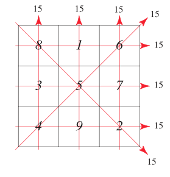

# Instructions  

Write a program that reads in a number *n* and then *n<sup>2</sup>* positive numbers. The number *n* will certainly be less than 20 (less than 400 numbers altogether). The program should store the numbers in a 2D array of *n* rows of *n* columns. For example if *n=2*, the input might look like this:

2 1 3 2 4

The resulting 2D array would look like this:

| 1 | 3 | . |more cols|
|:-:|:-:|:-:|:-:|
| 2 | 4 | . |.|
| . | . | .|.|
| more rows.... | . | .|.|

Note that you can declare the array size as 20x20 and be assured that you'll not exceed the bounds of the array since the number of numbers is guaranteed to be less than 400.

The goal of the program is to determine if the numbers form a [magic square](https://mathworld.wolfram.com/MagicSquare.html)

Here is a *n=3* example:



The program should print out:

1. The sum of every row
2. The sum of every column
3. The sum of both diagonals

If all these sums are the same the program should print "MAGIC!".

You can test your program without having to type every number by using the "shell" tab and using input redirection like so:

```
./main < magic1.txt
 15  15  15 | 15
----------------
  8   1   6 | 15
  3   5   7 | 15
  4   9   2 | 15
----------------
            | 15
MAGIC!
 ./main < magic2.txt
 34  34  34  34 | 34
--------------------
 16   3   2  13 | 34
  5  10  11   8 | 34
  9   6   7  12 | 34
  4  15  14   1 | 34
--------------------
                | 34
MAGIC!
 ./main < magic3.txt
 28  32  36  40 | 34
--------------------
  1   2   3   4 | 10
  5   6   7   8 | 26
  9  10  11  12 | 42
 13  14  15  16 | 58
--------------------
                | 34
```
